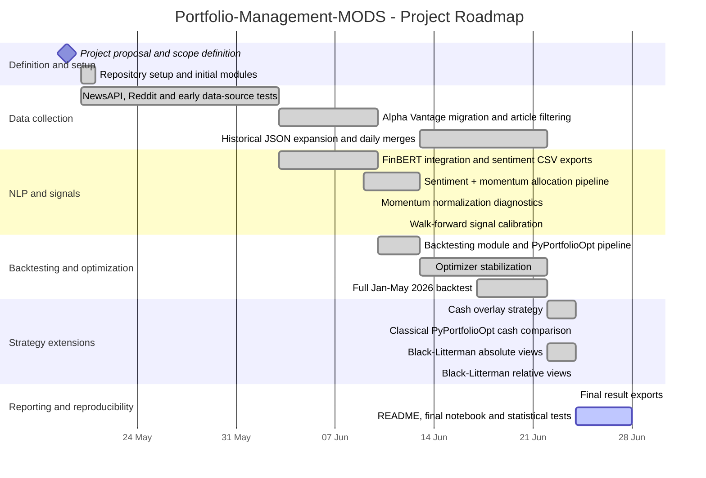

# Project Roadmap

This roadmap summarizes the development path of the Portfolio-Management-MODS project.

The project was built as an automated portfolio management pipeline combining financial news sentiment, momentum signals, and quantitative portfolio optimization.

## Gantt chart

## Main phases

### 1. Project definition

The project started with the definition of a reduced investment universe composed of five S&P 500 stocks from different sectors: Nike, Target, Disney, Starbucks, and Tesla.

The initial methodology was structured around two versions:

- V1: sentiment and momentum scoring;
- V2: portfolio optimization with PyPortfolioOpt.

Black-Litterman was identified early as a potential extension for integrating sentiment-based views into portfolio allocation.

### 2. Data collection

The first implementation phase focused on financial data collection.

The project tested several data sources, including NewsAPI, Reddit, Yahoo Finance, Alpha Vantage, StockTwits, FinanceHub, and Alpaca. NewsAPI was limited by the free plan and insufficient article volume, so the project progressively moved toward Alpha Vantage for financial news.

The data pipeline was then expanded to generate daily merged JSON files for the selected stocks.

### 3. NLP and signal construction

FinBERT was integrated to extract sentiment from financial news articles. Article-level sentiment scores were aggregated into daily ticker-level sentiment scores and exported to CSV.

The first allocation signal combined FinBERT sentiment with a momentum component. Later diagnostics showed that the initial min-max momentum normalization was too unstable on a universe of five stocks.

The momentum signal was therefore redesigned using a z-score-based method, with `tanh(z-score)` retained as the robust version.

### 4. Backtesting and optimization

A dedicated backtesting pipeline was implemented in `backtesting_2`.

The pipeline computes daily signals, optimizes portfolio weights, exports returns and weights, and compares the strategy with benchmarks.

The optimizer was stabilized by replacing unstable Sharpe-ratio maximization with quadratic utility maximization and fallback mechanisms.

### 5. Strategy extensions

Several extensions were added after the main backtesting framework was operational:

- limited cash overlay with maximum 20% cash;
- comparison between signal-adjusted and classical PyPortfolioOpt;
- Black-Litterman with absolute views;
- Black-Litterman with relative views and weighted cash overlay.

### 6. Final retained strategy

The retained strategy combines:

- FinBERT sentiment;
- corrected momentum using `tanh(z-score)`;
- fixed signal weighting with 80% sentiment and 20% momentum;
- PyPortfolioOpt optimization using quadratic utility;
- bounded long-only weights;
- maximum 20% cash overlay.

## Remaining work

The main remaining tasks are:

- rewrite the main README;
- add a final results notebook that loads existing CSV outputs;
- update the requirements file;
- add statistical validation of the Sharpe ratio and signal predictive power;
- integrate the article relevance filter into the main pipeline;
- clean duplicated raw data folders.

